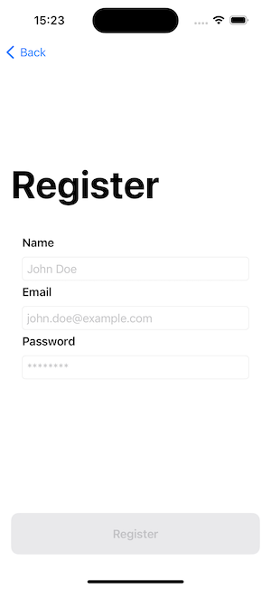
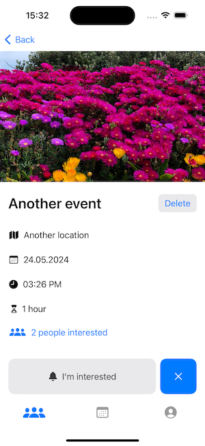
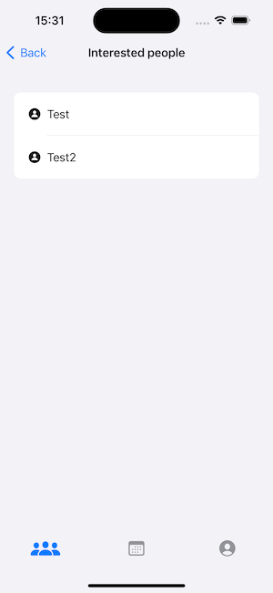

# domlouvac

An app for groups of friends to post upcoming events

Author: Jakub Bláha

## What is it about

The **domlouvac** application (domlouvač) is intended to serve as a tool for groups of friends to arrange meetings for joint activities. The application allows users to create groups, into which other users can subsequently join using a group code. Within these groups, users can create events, to which they can assign a name, date and time, location, duration, and a thematic image. Users can also delete events within the groups and leave the groups. Users can express their interest in attending an event by clicking the "I'm interested" button on the event detail screen. A user can also cancel their interest. Other users within the group can then view which users are interested in the event. Before using the application, it is necessary for the user to register and log in.

## Technicalities

The app communicates with the server over HTTP. The server is written in Swift using the Vapor and Fluent libraries.

On the server, a SQLite database is used, which is stored in the file `db.sqlite`, and the server listens on port `8080`. For the application to function correctly, the server must be running at the URL `http://localhost:8080`; otherwise, the application will show almost nothing.

Images are stored in the database encoded using base64.

To start the server, it is necessary to run the commands `cd Server` and `swift run`. The project with the iOS application is located in the App directory.

## Demo

### Joining a group, viewing events, participating and viewing participant list

### Creating a group and event

### Registering and logging in

## Screenshots

|                               |                                |                                     |                                 |
| ----------------------------- | ------------------------------ | ----------------------------------- | ------------------------------- |
|      |      |              |   |
|  |  |     |  |
|  |  |  |        |